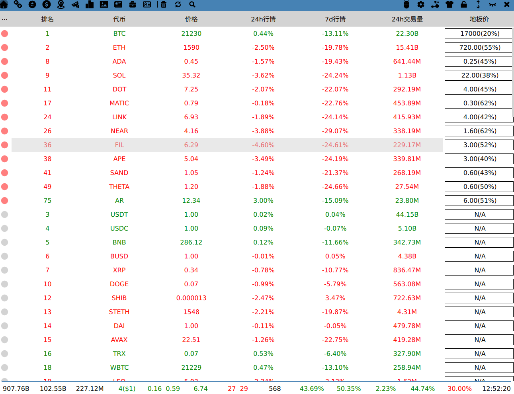
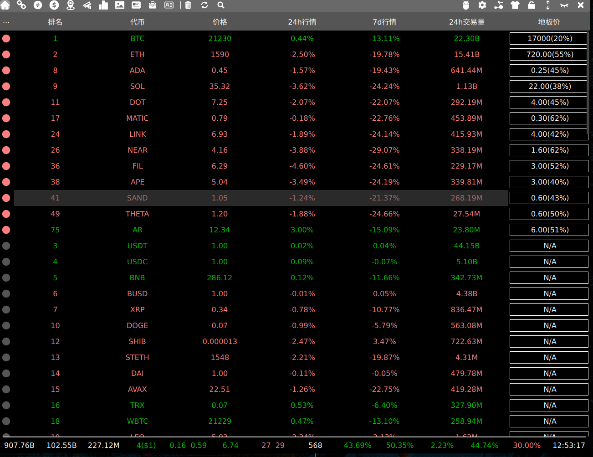

### 功能：
- 数字货币行情
- 稳定币行情
- 公链行情
- 交易所Btc变化情况
- NFT行情
- 公链锁仓图表
- 宏观资讯和加密货币资讯
- OKEX apiv5 账户信息
- 个人工具箱（用户归纳整理个人信息)
- 底部状态栏展示加密相关指数和信息

### 编译环境
- Linux
- Qt5.15
- Rust

### 编译
- cd ./cryptoinfo
- make build

### 运行
- cd ./cryptoinfo
- make run

### 参考
- [Writing a QML Application in Rust](https://dev.to/ayush1325/writing-a-qml-application-in-rust-part-1-3pgi)
- [qmetaobject-rs](https://github.com/woboq/qmetaobject-rs)
- [使用 linuxdeployqt 在 linux 下进行 Qt 打包发布](https://blog.csdn.net/zyhse/article/details/106381937)
